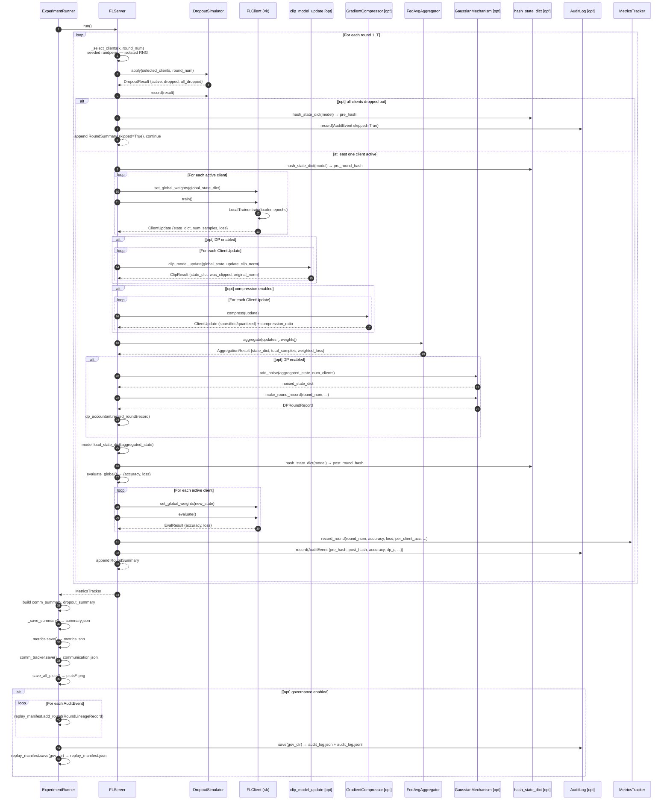

# FLP Architecture

## Overview

FLP is a single-process, simulation-first federated learning framework. Every component runs
in-process on one machine — there is no networking, no inter-process communication, and no
distributed runtime. The value is in the faithful simulation of real-world FL constraints
(non-IID data, dropout, differential privacy, auditability) while keeping the codebase small
and readable.

---

## Layer Map

```
┌──────────────────────────────────────────────────────────────────────┐
│  CLI  (flp.cli)                                                      │
│  flp run --config …  ·  flp validate-config …                       │
└───────────────────────────────┬──────────────────────────────────────┘
                                │
┌───────────────────────────────▼──────────────────────────────────────┐
│  Experiments  (flp.experiments)                                      │
│  ExperimentConfig (Pydantic)  ·  ExperimentRunner                   │
└──┬────────────────────────────────────────────────────────┬──────────┘
   │                                                        │
┌──▼────────────────────────────────┐   ┌──────────────────▼──────────┐
│  Core  (flp.core)                 │   │  Governance  (flp.governance)│
│  FLServer  ·  AsyncFLServer       │   │  AuditLog  ·  ReplayManifest│
│  FLClient  ·  FedAvgAggregator    │   │  hash_state_dict            │
│  LocalTrainer  ·  MNISTNet        │   └─────────────────────────────┘
│  FLEventLoop  ·  StalenessWeighter│
└──┬────────────────────────────────┘
   │
   ├───────────────┬───────────────────────────────┐
   │               │                               │
┌──▼────────────┐  ┌─▼───────────────────┐  ┌─────▼──────────────────┐
│  Simulation   │  │  Privacy            │  │  Compression           │
│  (flp.sim.)   │  │  (flp.privacy)      │  │  (flp.compression)     │
│  DataPartit.  │  │  GaussianMechanism  │  │  GradientCompressor    │
│  DropoutSim.  │  │  DPAccountant       │  │  topk_compress         │
│  DelaySimul.  │  │  clip_model_update  │  │  quantize_state_dict   │
└───────────────┘  └─────────────────────┘  │  ErrorFeedbackBuffer   │
   │                                        └────────────────────────┘
   │
┌──▼────────────────────┐   ┌──────────────────────────────────────────┐
│  Metrics (flp.metrics)│   │  Research  (flp.research)                │
│  MetricsTracker       │   │  compute_weight_divergence               │
│  CommunicationTracker │   │  cosine_similarity_between_updates       │
└───────────────────────┘   │  compute_fairness_metrics  ·  compute_gini│
                            │  qfedavg_weighted_loss                   │
                            └──────────────────────────────────────────┘
```

---

## Module Responsibilities

| Module | Key Classes / Functions | Responsibility |
|---|---|---|
| `core.models` | `MNISTNet` | CNN definition (shared by all clients and server) |
| `core.client` | `FLClient`, `ClientUpdate` | Holds local data partition; runs local SGD; returns weight update |
| `core.trainer` | `LocalTrainer`, `TrainResult`, `EvalResult` | SGD training loop and evaluation logic |
| `core.aggregator` | `FedAvgAggregator`, `AggregationResult` | Weighted average of client state dicts; accepts explicit weight vector |
| `core.server` | `FLServer`, `RoundSummary` | Orchestrates rounds: select → dropout → train → (clip) → (compress) → aggregate → evaluate |
| `core.event_loop` | `FLEventLoop`, `FLEvent` | Virtual-time priority queue ordered by `virtual_round`; pop/discard stale events |
| `core.async_server` | `AsyncFLServer`, `AsyncRoundSummary` | Extends `FLServer` with delivery delays, staleness enforcement, and staleness-aware aggregation weights |
| `core.staleness` | `StalenessWeighter` | Computes per-update aggregation weights from staleness values (uniform / inverse / exponential-decay) |
| `simulation.partitioning` | `DataPartitioner` | Splits dataset across clients (IID, Dirichlet, Shard) |
| `simulation.dropout` | `DropoutSimulator`, `DropoutResult` | Per-client random dropout each round (seeded, isolated RNG) |
| `simulation.delay` | `DelaySimulator` | Samples per-client delivery delays (seeded per round) |
| `privacy.clipping` | `clip_model_update`, `ClipResult` | L2-norm clipping of individual client updates |
| `privacy.dp` | `GaussianMechanism`, `DPAccountant`, `DPRoundRecord` | Gaussian noise injection + sequential privacy accounting |
| `compression.topk` | `topk_compress`, `TopKResult` | Keeps top-k% of float elements by absolute magnitude; zeros the rest |
| `compression.quantization` | `quantize_state_dict`, `QuantizationResult` | Simulates float16 (2×) or int8 (4×) precision loss via cast-and-cast-back |
| `compression.error_feedback` | `ErrorFeedbackBuffer` | Maintains per-client residual error across rounds; corrects next update before compression |
| `compression` | `GradientCompressor` | Server-side facade: owns `ErrorFeedbackBuffer`; dispatches to topk or quantization |
| `research.divergence` | `compute_weight_divergence`, `DivergenceResult` | L2 norm of client-global delta per client; mean and max aggregates |
| `research.divergence` | `cosine_similarity_between_updates` | Cosine similarity between two flattened float update vectors |
| `research.fairness` | `compute_gini`, `compute_fairness_metrics`, `FairnessResult` | Gini coefficient + variance + min/max/spread of per-client accuracies |
| `research.fairness` | `qfedavg_weighted_loss` | Loss reweighting `w_i = loss_i^q / Σ loss_j^q` for fairness-aware aggregation |
| `governance.hashing` | `hash_state_dict`, `hash_config` | Deterministic SHA-256 fingerprinting of model weights and configs |
| `governance.audit` | `AuditLog`, `AuditEvent` | Append-only per-round event log; saves JSON + JSONL |
| `governance.replay` | `ReplayManifest`, `RoundLineageRecord` | Full reproducibility manifest (schema 1.1) with git hash + feature flags |
| `metrics.tracker` | `MetricsTracker`, `RoundRecord` | Accumulates per-round global and per-client metrics |
| `metrics.communication` | `CommunicationTracker` | Tracks upload and download byte cost per round |
| `experiments.config_loader` | `ExperimentConfig` (Pydantic) | Validates and parses YAML experiment configs |
| `experiments.runner` | `ExperimentRunner` | Top-level orchestrator: data → clients → server → outputs |
| `visualization.plots` | `save_all_plots` | Saves matplotlib PNGs from a `MetricsTracker` |
| `cli` | `main`, `run`, `validate_config` | Click CLI entrypoints |

---

## Federated Round — Sequence Diagram

The diagram below shows one complete synchronous federated round. Optional paths (DP, compression,
governance, all-dropout skip) are annotated with `[opt]`. See the Async FL section below for the
async variant.



### Async FL Variant

When `async_fl.enabled: true`, `AsyncFLServer` replaces `FLServer`. The key differences:

1. **Push with delay** — after local training, each update is pushed to `FLEventLoop` at
   `virtual_round = round_num + ceil(sampled_delay)` rather than returned immediately.
2. **Pop ready** — at the start of each round, `pop_ready(round_num)` collects all events
   whose `virtual_round ≤ round_num` (updates that have "arrived").
3. **Discard stale** — events older than `staleness_threshold` rounds behind the current server
   version are dropped before aggregation.
4. **Staleness-aware weights** — `StalenessWeighter` translates staleness values to aggregation
   weights (uniform / inverse-staleness / exponential-decay), passed to `FedAvgAggregator`.

---

## Reproducibility Guarantees

Every source of randomness in FLP uses an isolated, seeded RNG so results are
bit-exact across runs with the same config.

| Randomness source | Seed formula | Generator |
|---|---|---|
| Global numpy / random | `config.seed` | `np.random.seed`, `random.seed` |
| Global torch | `config.seed` | `torch.manual_seed` |
| Client selection (round N) | `seed + N × 997` | `torch.Generator` (isolated) |
| Dropout (round N) | `seed + N × 31` | `random.Random` (isolated) |
| DP noise | `config.seed` | `torch.Generator` (isolated) |
| DataLoader shuffle (client C) | `seed XOR client_id` | `torch.Generator` (isolated) |
| Delivery delay sampling (round N) | `seed + N × 1000` | `random.Random` (isolated) |

Each isolated generator does **not** consume entropy from the global RNG, so
the order in which these RNGs are used cannot affect each other.

---

## Governance Hash Chain

When `governance.enabled: true`, every round records a SHA-256 fingerprint of
the global model immediately before and after aggregation.

```
Round 1:  pre_hash_1 ──► [aggregate] ──► post_hash_1
Round 2:  pre_hash_2 ──► [aggregate] ──► post_hash_2
          ▲
          └─ must equal post_hash_1

Round 3:  pre_hash_3 ──► [aggregate] ──► post_hash_3
          ▲
          └─ must equal post_hash_2
```

Any silent model mutation between rounds — a bug, injection, or storage
corruption — breaks the chain and can be detected by verifying
`post_round[N] == pre_round[N+1]` across the `replay_manifest.json`.

---

## Data Flow (End-to-End)

```
YAML config
    │
    ▼
ExperimentConfig (Pydantic validation)
    │
    ▼
ExperimentRunner
    ├── torchvision.datasets.MNIST  ──► DataPartitioner ──► N client index lists
    ├── build_model("cnn")          ──► MNISTNet (shared architecture)
    ├── FLClient × N               ◄── each gets own Subset + deep-copied model
    ├── CommunicationTracker
    ├── GradientCompressor          (if compression.enabled)
    ├── AuditLog + ReplayManifest  (if governance.enabled)
    └── FLServer  ─or─  AsyncFLServer  (if async_fl.enabled)
            │
            └── rounds 1..T
                    ├── client selection  (seeded randperm)
                    ├── DropoutSimulator
                    │
                    ├── [sync]  local training  (FLClient.train → LocalTrainer)
                    │                           ──► ClientUpdate list
                    │
                    ├── [async] push updates to FLEventLoop with sampled delay
                    │           pop_ready(round_num) → arrived updates
                    │           discard_stale(threshold) → live updates
                    │           StalenessWeighter → agg_weights
                    │
                    ├── L2 clipping      (if DP)
                    ├── GradientCompressor  (if compression.enabled)
                    │       topk_compress  ─or─  quantize_state_dict
                    │       ErrorFeedbackBuffer  (if error_feedback)
                    ├── FedAvgAggregator  (with optional staleness weights)
                    ├── Gaussian noise   (if DP) → DPAccountant
                    ├── global evaluation
                    ├── per-client evaluation
                    └── MetricsTracker
                            │
                            ▼
                    outputs/<name>/
                        summary.json
                        metrics.json
                        communication.json
                        global_model.pt        (if save_model)
                        plots/                 (if save_plots)
                        governance/            (if governance.enabled)
                            audit_log.json
                            audit_log.jsonl
                            replay_manifest.json   ← schema 1.1: git hash + feature flags
```
