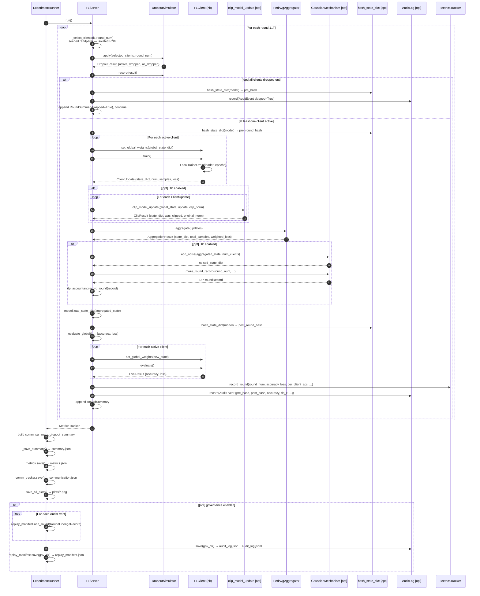

# FLP Architecture

## Overview

FLP is a single-process, simulation-first federated learning framework. Every component runs
in-process on one machine — there is no networking, no inter-process communication, and no
distributed runtime. The value is in the faithful simulation of real-world FL constraints
(non-IID data, dropout, differential privacy, auditability) while keeping the codebase small
and readable.

---

## Layer Map

```
┌──────────────────────────────────────────────────────────────────────┐
│  CLI  (flp.cli)                                                      │
│  flp run --config …  ·  flp validate-config …                       │
└───────────────────────────────┬──────────────────────────────────────┘
                                │
┌───────────────────────────────▼──────────────────────────────────────┐
│  Experiments  (flp.experiments)                                      │
│  ExperimentConfig (Pydantic)  ·  ExperimentRunner                   │
└──┬────────────────────────────────────────────────────────┬──────────┘
   │                                                        │
┌──▼──────────────────────┐          ┌─────────────────────▼──────────┐
│  Core  (flp.core)       │          │  Governance  (flp.governance)  │
│  FLServer               │          │  AuditLog  ·  ReplayManifest   │
│  FLClient               │          │  hash_state_dict               │
│  FedAvgAggregator       │          └────────────────────────────────┘
│  LocalTrainer           │
│  MNISTNet               │
└──┬──────────────────────┘
   │
   ├────────────────────────────────────────────────────────┐
   │                                                        │
┌──▼──────────────────────┐          ┌─────────────────────▼──────────┐
│  Simulation             │          │  Privacy  (flp.privacy)        │
│  (flp.simulation)       │          │  GaussianMechanism             │
│  DataPartitioner        │          │  DPAccountant                  │
│  DropoutSimulator       │          │  clip_model_update             │
│  DelaySimulator         │          └────────────────────────────────┘
└─────────────────────────┘
   │
┌──▼──────────────────────┐
│  Metrics  (flp.metrics) │
│  MetricsTracker         │
│  CommunicationTracker   │
└─────────────────────────┘
```

---

## Module Responsibilities

| Module | Key Classes / Functions | Responsibility |
|---|---|---|
| `core.models` | `MNISTNet` | CNN definition (shared by all clients and server) |
| `core.client` | `FLClient`, `ClientUpdate` | Holds local data partition; runs local SGD; returns weight update |
| `core.trainer` | `LocalTrainer`, `TrainResult`, `EvalResult` | SGD training loop and evaluation logic |
| `core.aggregator` | `FedAvgAggregator`, `AggregationResult` | Weighted average of client state dicts |
| `core.server` | `FLServer`, `RoundSummary` | Orchestrates rounds: select → dropout → train → aggregate → evaluate |
| `simulation.partitioning` | `DataPartitioner` | Splits dataset across clients (IID, Dirichlet, Shard) |
| `simulation.dropout` | `DropoutSimulator`, `DropoutResult` | Per-client random dropout each round (seeded, isolated RNG) |
| `simulation.delay` | `DelaySimulator` | Straggler filtering by simulated upload delay |
| `privacy.clipping` | `clip_model_update`, `ClipResult` | L2-norm clipping of individual client updates |
| `privacy.dp` | `GaussianMechanism`, `DPAccountant`, `DPRoundRecord` | Gaussian noise injection + sequential privacy accounting |
| `governance.hashing` | `hash_state_dict`, `hash_config` | Deterministic SHA-256 fingerprinting of model weights and configs |
| `governance.audit` | `AuditLog`, `AuditEvent` | Append-only per-round event log; saves JSON + JSONL |
| `governance.replay` | `ReplayManifest`, `RoundLineageRecord` | Full reproducibility manifest with round-level lineage |
| `metrics.tracker` | `MetricsTracker`, `RoundRecord` | Accumulates per-round global and per-client metrics |
| `metrics.communication` | `CommunicationTracker` | Tracks upload and download byte cost per round |
| `experiments.config_loader` | `ExperimentConfig` (Pydantic) | Validates and parses YAML experiment configs |
| `experiments.runner` | `ExperimentRunner` | Top-level orchestrator: data → clients → server → outputs |
| `visualization.plots` | `save_all_plots` | Saves 4 matplotlib PNGs from a `MetricsTracker` |
| `cli` | `main`, `run`, `validate_config` | Click CLI entrypoints |

---

## Federated Round — Sequence Diagram

The diagram below shows one complete federated round. Optional paths (DP, governance, all-dropout
skip) are annotated with `[opt]`.



---

## Reproducibility Guarantees

Every source of randomness in FLP uses an isolated, seeded RNG so results are
bit-exact across runs with the same config.

| Randomness source | Seed formula | Generator |
|---|---|---|
| Global numpy / random | `config.seed` | `np.random.seed`, `random.seed` |
| Global torch | `config.seed` | `torch.manual_seed` |
| Client selection (round N) | `seed + N × 997` | `torch.Generator` (isolated) |
| Dropout (round N) | `seed + N × 31` | `random.Random` (isolated) |
| DP noise | `config.seed` | `torch.Generator` (isolated) |
| DataLoader shuffle (client C) | `seed XOR client_id` | `torch.Generator` (isolated) |

Each isolated generator does **not** consume entropy from the global RNG, so
the order in which these RNGs are used cannot affect each other.

---

## Governance Hash Chain

When `governance.enabled: true`, every round records a SHA-256 fingerprint of
the global model immediately before and after aggregation.

```
Round 1:  pre_hash_1 ──► [aggregate] ──► post_hash_1
Round 2:  pre_hash_2 ──► [aggregate] ──► post_hash_2
          ▲
          └─ must equal post_hash_1

Round 3:  pre_hash_3 ──► [aggregate] ──► post_hash_3
          ▲
          └─ must equal post_hash_2
```

Any silent model mutation between rounds — a bug, injection, or storage
corruption — breaks the chain and can be detected by verifying
`post_round[N] == pre_round[N+1]` across the `replay_manifest.json`.

---

## Data Flow (End-to-End)

```
YAML config
    │
    ▼
ExperimentConfig (Pydantic validation)
    │
    ▼
ExperimentRunner
    ├── torchvision.datasets.MNIST  ──► DataPartitioner ──► N client index lists
    ├── build_model("cnn")          ──► MNISTNet (shared architecture)
    ├── FLClient × N               ◄── each gets own Subset + deep-copied model
    ├── CommunicationTracker
    ├── AuditLog + ReplayManifest  (if governance.enabled)
    └── FLServer
            │
            └── rounds 1..T
                    ├── client selection
                    ├── DropoutSimulator
                    ├── local training  (FLClient.train → LocalTrainer)
                    ├── L2 clipping    (if DP)
                    ├── FedAvgAggregator
                    ├── Gaussian noise (if DP) → DPAccountant
                    ├── global evaluation
                    ├── per-client evaluation
                    └── MetricsTracker
                            │
                            ▼
                    outputs/<name>/
                        summary.json
                        metrics.json
                        communication.json
                        global_model.pt        (if save_model)
                        plots/                 (if save_plots)
                        governance/            (if governance.enabled)
                            audit_log.json
                            audit_log.jsonl
                            replay_manifest.json
```
